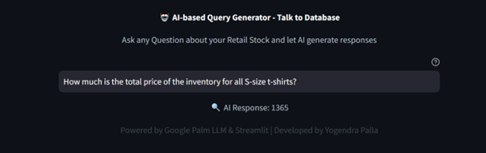

# AI-based SQL Query Generator : Talk to a Database 

This project uses Google PaLM LLM and LangChain to create a system that lets users ask questions in plain English, and it responds with accurate answers by querying a MySQL database.

A T-shirt store, stores its inventory, sales, and discount data in MySQL. A store manager can ask:

"How many white Nike T-shirts are left in stock?"
"What will be our total sales if we sell all small T-shirts with discounts applied?"
The system understands these questions, converts them into SQL queries, runs them on the database, and provides correct answers.



## Project Highlights

We have a store that sells Adidas, Nike, Van Heusen, and Levi's T-shirts. Their inventory, sales, and discount data are stored in a MySQL database.

We are building an LLM-powered question-and-answer system that will allow the store manager to ask questions in natural language and get accurate answers. The system will use:

- Google PaLM LLM for natural language understanding
- Hugging Face embeddings to enhance text processing
- Streamlit for a user-friendly interface
- LangChain for seamless integration
- ChromaDB as a vector store for efficient data retrieval
- Few-shot learning to improve query accuracy
Through the UI, the store manager can ask questions like:

"How many white Nike T-shirts are in stock?"
"What will be our total sales if we sell all extra-small T-shirts with discounts applied?"
The system will intelligently process these queries, convert them into SQL, execute them on MySQL, and display the correct answers.


## Installation

1.Clone this repository to your local machine using:

```bash
  git clone https://github.com/yogekrish/Gen-AI-based-SQL-Query-Generator.git
```
2.Navigate to the project directory:

```bash
  cd Gen-AI-based-SQL-Query-Generator
```
3. Install the required dependencies using pip:

```bash
  pip install -r requirements.txt
```
4.Acquire an api key through makersuite.google.com and put it in .env file

```bash
  GOOGLE_API_KEY="your_api_key_here"
```
5. For database setup, run database/db_creation_t_shirts.sql in your MySQL workbench

## Usage

1. Run the Streamlit app by executing:
```bash
streamlit run main.py

```

2.The web app will open in your browser where you can ask questions

## Sample Questions
  - How many total t shirts are left in total in stock?
  - How much is the total price of the inventory for all S-size t-shirts?
  - How much sales amount will be generated if we sell all small size adidas shirts today after discounts?
  
## Project Structure

- main.py: The main Streamlit application script.
- langchain_helper.py: This has all the langchain code
- requirements.txt: A list of required Python packages for the project.
- few_shots.py: Contains few shot prompts
- .env: Configuration file for storing your Google API key.